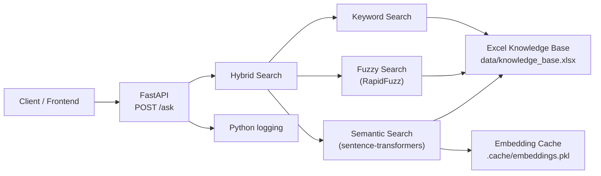
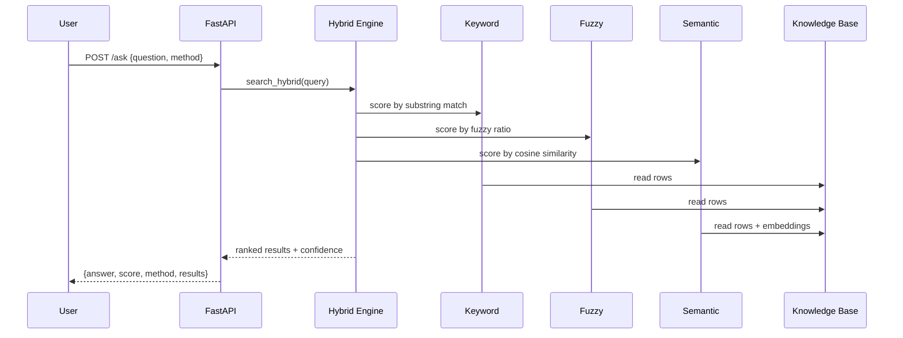

# Q&A Knowledge System

An Excel-powered question-answering API that combines **keyword**, **fuzzy**, **semantic**, and **hybrid** search to retrieve answers from a structured knowledge base.

Built with FastAPI, sentence-transformers, and RapidFuzz.

---

## Features

- **Multi-strategy search** — keyword, fuzzy (typo-tolerant), semantic (embedding-based), and hybrid (weighted combination)
- **Confidence scores** — every result includes a 0–1 confidence score
- **Structured knowledge base** — loads Q&A pairs from Excel (`id`, `question`, `answer`, `category`, `keywords`)
- **Auto-generated API docs** — interactive Swagger UI at `/docs`
- **Structured logging** — query, method, score, and latency logged on every request
- **Docker-ready** — run with a single `docker compose up`
- **CI pipeline** — GitHub Actions runs tests on every push

---

## Architecture



### Search pipeline



---

## Project Structure

```
Qs/
├── app/
│   ├── main.py              # FastAPI entrypoint
│   ├── api/                 # (reserved)
│   ├── core/
│   │   ├── config.py        # Settings via environment variables
│   │   ├── loader.py        # Excel knowledge base loader
│   │   └── logging.py       # Logging configuration
│   ├── models/
│   │   └── schemas.py       # Pydantic request/response models
│   ├── search/
│   │   ├── engine.py        # Keyword search
│   │   ├── fuzzy.py         # Fuzzy search
│   │   ├── semantic.py      # Semantic (embedding) search
│   │   └── hybrid.py        # Hybrid combiner
│   └── services/
│       └── database.py      # SQLite migration (optional)
├── data/
│   └── knowledge_base.xlsx  # Default knowledge base
├── tests/
│   ├── test_loader.py
│   ├── test_search.py
│   └── test_api.py
├── Dockerfile
├── docker-compose.yml
├── requirements.txt
└── .github/workflows/ci.yml
```

---

## Installation

### Prerequisites

- Python 3.11+
- pip

### Local setup

```bash
git clone https://github.com/shamratneero/qa-knowledge-system.git
cd qa-knowledge-system

python3 -m venv venv
source venv/bin/activate        # Windows: venv\Scripts\activate

pip install -r requirements.txt
```

### Run the API

```bash
uvicorn app.main:app --reload
```

Open **http://127.0.0.1:8000/docs** for Swagger UI.

### Docker

```bash
docker compose up --build
```

API available at **http://localhost:8000**.

---

## API Endpoints

| Method | Path | Description |
|--------|------|-------------|
| `GET` | `/` | API info |
| `GET` | `/health` | Health check |
| `POST` | `/ask` | Search the knowledge base |

### `POST /ask`

**Request body:**

```json
{
  "question": "What is machine learning?",
  "method": "hybrid",
  "top_n": 5
}
```

| Field | Type | Default | Description |
|-------|------|---------|-------------|
| `question` | string | required | User question (1–500 chars) |
| `method` | string | `"hybrid"` | `hybrid`, `keyword`, `fuzzy`, or `semantic` |
| `top_n` | int | `5` | Number of results (1–50) |

**Success response (200):**

```json
{
  "found": true,
  "query": "What is machine learning?",
  "method": "hybrid",
  "answer": "Machine Learning is a subset of AI that learns patterns from data.",
  "score": 0.87,
  "results": [
    {
      "id": 2,
      "question": "What is Machine Learning?",
      "answer": "Machine Learning is a subset of AI that learns patterns from data.",
      "category": "ML",
      "keywords": "Machine Learning,ML",
      "score": 0.87,
      "confidence": 0.87
    }
  ]
}
```

**Error responses:**

| Status | When |
|--------|------|
| `404` | No matching answer found |
| `422` | Invalid request body (empty question, bad method) |
| `500` | Internal search error |

### Example requests

```bash
# Health check
curl http://127.0.0.1:8000/health

# Keyword search
curl -X POST http://127.0.0.1:8000/ask \
  -H "Content-Type: application/json" \
  -d '{"question": "What is AI?", "method": "keyword"}'

# Hybrid search (default)
curl -X POST http://127.0.0.1:8000/ask \
  -H "Content-Type: application/json" \
  -d '{"question": "Tell me about artificial intelligence", "method": "hybrid"}'

# Fuzzy search (typo-tolerant)
curl -X POST http://127.0.0.1:8000/ask \
  -H "Content-Type: application/json" \
  -d '{"question": "What is Machne Learning?", "method": "fuzzy"}'
```

### Swagger UI

Start the server and visit **http://127.0.0.1:8000/docs**:

Use the live `/docs` page for interactive testing.

---

## Knowledge Base Format

Place an Excel file at `data/knowledge_base.xlsx` with these columns:

| Column | Required | Description |
|--------|----------|-------------|
| `id` | yes | Unique identifier |
| `question` | yes | The question text |
| `answer` | yes | The answer text |
| `category` | yes | Category label |
| `keywords` | yes | Comma-separated keywords |

---

## Testing

```bash
# Fast tests (keyword, fuzzy, API, loader)
pytest -m "not slow" -v

# All tests including semantic/hybrid (downloads ML model on first run)
pytest -v

# Run benchmark harness
python scripts/benchmark.py
```

---

## Configuration

Set via environment variables or a `.env` file:

| Variable | Default | Description |
|----------|---------|-------------|
| `LOG_LEVEL` | `INFO` | Logging verbosity |
| `HOST` | `127.0.0.1` | Server host |
| `PORT` | `8000` | Server port |
| `DEBUG` | `false` | Debug mode |

---

## Future Improvements

- [ ] **Benchmark suite** — 100-question eval set with precision, recall, top-1/top-3 accuracy
- [ ] **RAG upgrade** — retrieve top-5 results, pass to LLM for natural language answers
- [ ] **Vector index** — replace brute-force cosine similarity with FAISS for larger knowledge bases
- [ ] **Frontend** — simple React/Next.js question-answer UI
- [ ] **Live deployment** — deploy to Railway, Render, or Azure
- [ ] **SQLite integration** — wire database layer into search for dynamic KB updates

---

## License

MIT
